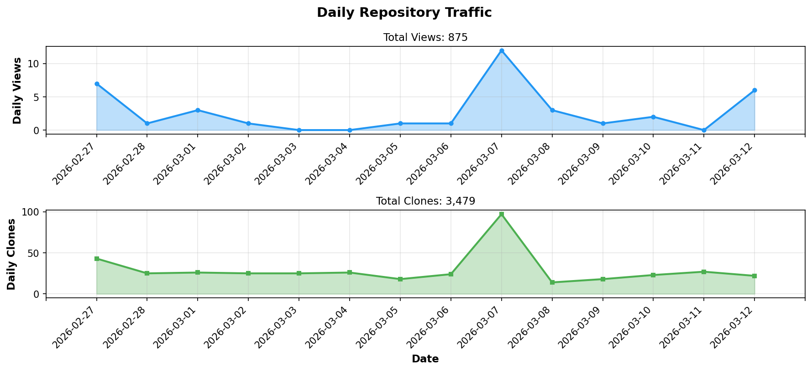
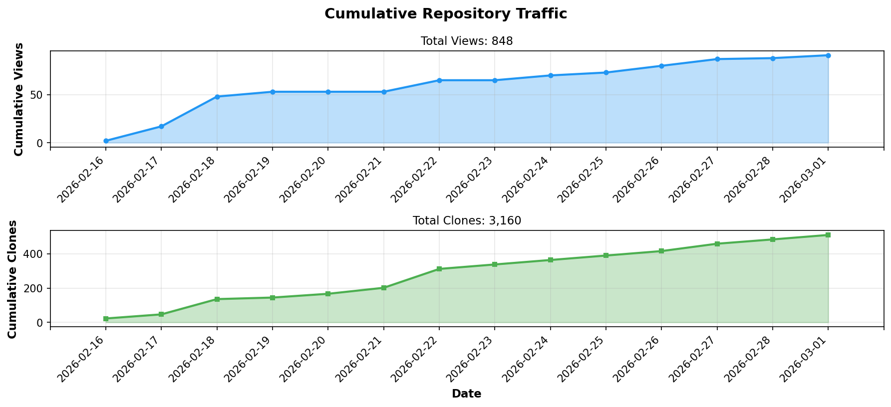

# Promps - Visual Prompt Builder

<div align="center">

> **A Visual Block-Based Tool for Creating Structured AI Prompts**
> **AIプロンプト作成のためのビジュアルブロックベースツール**

[](https://github.com/BonoJovi/Promps/releases)
[](https://github.com/BonoJovi/Promps/releases/tag/v1.4.0-free)
[](https://github.com/BonoJovi/Promps)
[](https://www.rust-lang.org/)
[](https://tauri.app/)
[](LICENSE)

**Build prompts by dragging and dropping blocks, just like Scratch!**
**Scratchのようにブロックをドラッグ&ドロップしてプロンプトを作成！**

</div>

---

> **🚀 Promps Pro Now Available! / Promps Pro 登場！**
>
> Looking for more features? **[Promps Pro](https://promps.org)** offers advanced capabilities for professional use.
>
> より多くの機能をお探しですか？**[Promps Pro](https://promps.org)** はプロフェッショナル向けの高度な機能を提供します。

---

## Message from Developer / 開発者からのメッセージ

<div style="border: 3px solid #4a90e2; padding: 20px; margin: 20px 0; background-color: #f8f9fa; font-size: 1.1em;">

### Prompsユーザの皆さんへ

いつもPrompsに関心を寄せていただき、誠にありがとうございます。
プロジェクト発案者のBonoJovi(Yoshihiro NAKAHARA)です。

**🎉 Ver.1.3.3 (安定版) をリリースいたしました！**

v1.3.3ではダークモードとテンプレート機能を追加しました。

**主な機能**:
- **ビジュアルブロック編集** - Scratchのようにドラッグ&ドロップでプロンプト作成
- **リアルタイム文法検証** - 6つのルールでブロック配置を即座にチェック
- **自動修正(AutoFix)** - ワンクリックでブロックを自動挿入
- **7種類のパターンテンプレート** - 日本語文型に沿ったスマート補完
- **プロジェクト保存/読込** - .promps形式で作業を保存・再開
- **ダークモード** - 目に優しいダークテーマ
- **テンプレート機能** - ブロックグループをマクロとして保存・再利用

**[Announcement] フィードバックをお待ちしています！**
- 使いやすさはいかがですか？
- どんな機能があると便利ですか？
- [Issues](https://github.com/BonoJovi/Promps/issues) または [Discussions](https://github.com/BonoJovi/Promps/discussions) でご意見をお寄せください！

**2026-01-26 (JST) Written by Yoshihiro NAKAHARA**

---

### To Promps Users

Thank you for your continued interest in Promps.
I'm BonoJovi (Yoshihiro NAKAHARA), the project initiator.

**🎉 We have released Ver.1.3.3 (Stable)!**

v1.3.3 adds dark mode and template feature.

**Key Features**:
- **Visual block editing** - Create prompts by drag & drop, just like Scratch
- **Real-time grammar validation** - 6 rules to instantly check block placement
- **AutoFix** - One-click automatic block insertion
- **7 pattern templates** - Smart completion following Japanese sentence patterns
- **Project save/load** - Save and resume your work in .promps format
- **Dark mode** - Eye-friendly dark theme
- **Template feature** - Save and reuse block groups as macros

**[Announcement] We want to hear from you!**
- How is the usability?
- What features would be helpful?
- Share your ideas on [Issues](https://github.com/BonoJovi/Promps/issues) or [Discussions](https://github.com/BonoJovi/Promps/discussions)!

**2026-01-26 (JST) Written by Yoshihiro NAKAHARA**

</div>

---

## ✅ Stable Release / 安定版リリース

**This is the Stable release (v1.3.3)** - production ready.
**これは安定版リリース(v1.3.3)です** - 本番利用可能。

**Available Features: / 利用可能な機能：**
- ✅ Visual block-based interface / ビジュアルブロックベースインターフェース
- ✅ Real-time grammar validation (6 rules) / リアルタイム文法検証（6ルール）
- ✅ AutoFix (one-click block insertion) / 自動修正機能
- ✅ 7 pattern templates / 7種類のパターンテンプレート
- ✅ 9 punctuation blocks / 9種類の句読点ブロック
- ✅ Project save/load (.promps format) / プロジェクト保存/読込（.promps形式）
- ✅ Verb blocks (11 types + custom input) / 動詞ブロック（固定11種＋カスタム入力）
- ✅ Particle blocks (9 types) / 助詞ブロック（9種類）
- ✨ **Feedback welcome!** / **フィードバック歓迎！**

**We're looking for testers!** Your feedback will shape the future of Promps. See [CONTRIBUTING.md](CONTRIBUTING.md) for how to help.
**テスターを募集しています！** あなたのフィードバックがPrompsの未来を形作ります。協力方法は[CONTRIBUTING.md](CONTRIBUTING.md)をご覧ください。

---

## Quick Start / クイックスタート

### 1. Download & Install / ダウンロード & インストール

**Download the latest release: / 最新リリースをダウンロード：**
- [Download v1.3.3](https://github.com/BonoJovi/Promps/releases/tag/v1.3.3-free)

**Available for: / 対応プラットフォーム：**
- Linux (AppImage, deb, rpm)
- Windows (exe installer, msi)
- macOS (dmg for Intel and Apple Silicon)

### 2. Build from Source / ソースからビルド

```bash
# Clone the repository / リポジトリをクローン
git clone https://github.com/BonoJovi/Promps.git
cd Promps

# Build the application / アプリケーションをビルド
cargo tauri build

# Or run in development mode / または開発モードで実行
cargo tauri dev
```

---

## How to Use / 使い方

### Step 1: Place Blocks / ステップ1: ブロックを配置

Drag blocks from the left panel to the workspace.
左パネルからワークスペースにブロックをドラッグします。

**Available block types: / 利用可能なブロックタイプ：**

- **Noun Block (名詞)**: For entities like "User", "Order", "Database"
  エンティティ用（「ユーザー」「注文」「データベース」など）

- **Particle Block (助詞)**: Japanese particles
  日本語の助詞（「が」「を」「に」「で」「と」「へ」「から」「まで」「より」）

- **Verb Block (動詞) [Expanded in v0.0.3-2]**: 11 common verbs + custom input
  よく使う動詞11種（「分析して」「要約して」「翻訳して」「比較して」「調べて」「一覧にして」「説明して」「生成して」「評価して」「修正して」「変換して」）+ カスタム入力

- **Other Block (その他)**: For other words
  その他の単語用

### Step 2: Connect Blocks / ステップ2: ブロックを接続

- Snap blocks together to form sentences
  ブロックをスナップして文を形成します

- Blocks connect vertically to create sequences
  ブロックは縦方向に接続してシーケンスを作成します

### Step 3: Generate Prompt / ステップ3: プロンプトを生成

- Your prompt appears in real-time in the preview panel
  プレビューパネルにリアルタイムでプロンプトが表示されます

- Noun blocks are automatically marked with `(NOUN)` in the output
  名詞ブロックは出力で自動的に`(NOUN)`マークが付きます

- Copy the generated prompt for use with AI assistants
  生成されたプロンプトをコピーしてAIアシスタントで使用できます

---

## Example Usage / 使用例

### Building a Simple Prompt / シンプルなプロンプトの構築

**Blocks: / ブロック：**
```
[Noun: User] → [Particle: が] → [Noun: Order] → [Particle: を] → [Other: 作成]
```

**Generated Output: / 生成される出力：**
```
User (NOUN) が Order (NOUN) を 作成
```

### Using Verb Blocks (v0.0.3-2) / 動詞ブロックの使用

**Blocks: / ブロック：**
```
[Noun: Document] → [Particle: を] → [Verb: 分析して]
```

**Generated Output: / 生成される出力：**
```
Document (NOUN) を 分析して
```

**Blocks: / ブロック：**
```
[Noun: Text] → [Particle: を] → [Noun: English] → [Particle: に] → [Verb: 翻訳して]
```

**Generated Output: / 生成される出力：**
```
Text (NOUN) を English (NOUN) に 翻訳して
```

### Building a Complex Prompt / 複雑なプロンプトの構築

**Blocks: / ブロック：**
```
[Noun: データベース] → [Particle: から] → [Noun: レコード] → [Particle: を]
→ [Other: 取得して] → [Noun: ファイル] → [Particle: に] → [Other: 保存]
```

**Generated Output: / 生成される出力：**
```
データベース (NOUN) から レコード (NOUN) を 取得して ファイル (NOUN) に 保存
```

---

## Features / 機能

### Current Features / 現在の機能

- ✅ Visual block-based interface (powered by Blockly.js)
  ビジュアルブロックベースのインターフェース（Blockly.js搭載）

- ✅ **NEW in v0.0.4:** Project save/load (.promps format)
  **v0.0.4新機能:** プロジェクト保存/読込（.promps形式）

- ✅ **NEW in v0.0.4:** Toolbar (New, Open, Save, Save As)
  **v0.0.4新機能:** ツールバー（New, Open, Save, Save As）

- ✅ **NEW in v0.0.4:** Keyboard shortcuts (Ctrl+N/O/S, Ctrl+Shift+S)
  **v0.0.4新機能:** キーボードショートカット

- ✅ 9 types of particle blocks (が、を、に、で、と、へ、から、まで、より)
  9種類の助詞ブロック

- ✅ Verb blocks (11 fixed + custom input)
  動詞ブロック（固定11種＋カスタム入力）

- ✅ Collapsible category UI (Noun, Particle, Verb, Other)
  折りたたみ可能なカテゴリUI（名詞、助詞、動詞、その他）

- ✅ Real-time prompt preview
  リアルタイムプロンプトプレビュー

- ✅ Automatic noun detection and marking
  自動名詞検出とマーキング

- ✅ Simple drag-and-drop operation
  シンプルなドラッグ&ドロップ操作

- ✅ Desktop application (Tauri + Rust)
  デスクトップアプリケーション（Tauri + Rust）

- ✅ Multi-platform support (Linux, Windows, macOS)
  マルチプラットフォーム対応

### New in v0.0.6 / v0.0.6の新機能

- ✅ **Grammar validation (basic)** - 4 rules: particle position, consecutive particles, verb position, consecutive nouns
  **文法検証（基本）** - 4ルール: 助詞位置、連続助詞、動詞位置、連続名詞

- ✅ **Grammar validation (advanced + AutoFix)** - 2 additional rules with one-click fix
  **文法検証（高度＋自動修正）** - 追加2ルール＋ワンクリック修正

- ✅ **7 Pattern templates** - SOV, OV, Topic, Means, Parallel, Source-Dest, OSV
  **7種類のパターンテンプレート** - 基本文型、目的語文型、トピック文型など

- ✅ **9 Punctuation blocks** - 、。！？"'，/&
  **9種類の句読点ブロック**

### Coming Soon / 近日実装予定

- [Soon] More verb types and adjective blocks
  より多くの動詞タイプと形容詞ブロック

- [Soon] Layout customization
  レイアウトのカスタマイズ

- [Soon] Export to various AI formats
  各種AI向けフォーマット出力

---

## Join Our Community / コミュニティに参加

**Help make Promps better for everyone!**
**Prompsをみんなのためにより良くするお手伝いをしてください！**

We welcome **all types of contributions** - not just code!
**あらゆる形の貢献**を歓迎します—コードだけではありません！

---

### Testers Wanted! / テスター募集！

**No programming experience needed! / プログラミング経験不要！**

**✨ v1.5.0 Stable Release - French Language Support (Trilingual)!**
**[新着] v1.5.0 安定版リリース！フランス語対応（3言語対応）！**

**Platform Status: / プラットフォーム状況：**
- ✅ **Linux**: Verified and tested by developer / 開発者により検証済み・テスト済み
- ⚠ **Windows**: **Binary available but needs real hardware testing!** / **バイナリは利用可能だが実機テストが必要！**
- ⚠ **macOS (Intel & Apple Silicon)**: **Binary available but needs real hardware testing!** / **バイナリは利用可能だが実機テストが必要！**

**What we need from you: / お願いしたいこと：**
- Download and test the latest release / 最新リリースをダウンロード＆テスト
- Report any bugs or issues you encounter / 遭遇したバグや問題を報告
- Confirm if basic features work correctly / 基本機能が正常に動作するか確認
- Share your experience (UI/UX feedback welcome!) / 使用感を共有（UI/UXフィードバック歓迎！）
- Suggest new features or improvements / 新機能や改善点を提案

**Download:** [Latest Release](https://github.com/BonoJovi/Promps/releases/latest)

---

### Feature Requests & Feedback / 機能リクエスト & フィードバック

Have ideas to make Promps better?
Prompsをより良くするアイデアはありますか？

- ✨ **[Submit Feature Request](https://github.com/BonoJovi/Promps/issues/new)**
- [Bug] **[Report a Bug](https://github.com/BonoJovi/Promps/issues/new)**
- [Chat] **[Join Discussions](https://github.com/BonoJovi/Promps/discussions)** - Q&A, Ideas, General chat / 質問、アイデア、雑談
  - **[Welcome Post](https://github.com/BonoJovi/Promps/discussions/1)** - Start here! / ここから始めよう！
  - **[Discussion Guidelines](.github/DISCUSSIONS.md)** - How to use discussions / ディスカッション利用ガイド

---

### Developers / 開発者

For code contributions:
コード貢献について：

- **[Contributing Guide](CONTRIBUTING.md)**
- **[Development Documentation](docs/)**

---

## Release History / リリース履歴

### Version 1.5.0 (2026-02-23) ✨ French Language Support (Trilingual)

**New Features: / 新機能：**
- ✨ **French Language Support**: Added French as third language (ja → en → fr toggle cycle)
  **フランス語対応**: フランス語を第3言語として追加（ja → en → fr トグル切替）
- ✨ **French Grammar Validation**: SVO grammar rules with French token classification
  **フランス語文法チェック**: フランス語トークン分類によるSVO文法ルール
- ✨ **French Pattern Templates**: 7 French prompt patterns
  **フランス語パターンテンプレート**: 7つのフランス語プロンプトパターン
- ✨ **Locale-aware Punctuation**: Japanese mode shows 、。, English/French mode shows , .
  **言語別句読点**: 日本語モードでは、。、英仏モードでは , . を表示

### Version 1.4.0 (2026-02-22) ✨ Drag & Drop Template Insertion

**New Features: / 新機能：**
- ✨ **Drag & Drop Template Insertion**: Templates are now draggable blocks in the toolbox, matching Ent edition behavior
  **ドラッグ＆ドロップ テンプレート挿入**: テンプレートがツールボックス内のドラッグ可能ブロックになり、Ent版と同じ動作に統一
- ✨ **Center Placement**: Template blocks are automatically placed at the center of the visible display area
  **中央配置**: テンプレートブロックが表示領域の中央に自動配置
- 🐛 **Scroll Position Fix**: Scrollbar no longer jumps when inserting templates
  **スクロール位置修正**: テンプレート挿入時にスクロールバーが飛ばなくなった
- 🐛 **Initial Scroll Fix**: Workspace scrollbar starts at top-left position on launch
  **初期スクロール修正**: 起動時にワークスペースのスクロールバーが左上に配置

### Version 1.3.5 (2026-02-22) 🐛 Template Dialog Fix

**Bug Fix: / バグ修正：**
- 🐛 **Template Save Dialog Fix**: Replaced native prompt() with custom modal to prevent Blockly workspace freeze in Tauri WebView
  **テンプレート保存ダイアログ修正**: ネイティブprompt()をカスタムモーダルに置換し、Tauri WebViewでのBlocklyワークスペースフリーズを防止
- 🌐 **Template Dialog i18n**: Added localized placeholder for template name input
  **テンプレートダイアログi18n**: テンプレート名入力のプレースホルダーを多言語対応

### Version 1.3.4 (2026-02-22) 🔧 _V: Verb Prefix for Grammar Validation

**Enhancement: / 改善：**
- 🔧 **_V: Verb Prefix**: Added _V: prefix to all verb block generators for 100% reliable verb classification in grammar validation
  **_V: 動詞プレフィックス**: 全動詞ブロックジェネレーターに_V:プレフィックスを追加し、文法検証での動詞分類を100%信頼性に向上
- 🐛 **Period Validation Fix**: Fixed false "period must follow verb" error for verbs like 教えて
  **句点検証修正**: 「教えて」等の動詞で発生していた「句点は動詞の後でのみ使用可能」の誤検知を修正

### Version 1.3.3 (2026-02-18) 🔒 CSS Variable Migration & Security

**Improvements: / 改善：**
- 🎨 Complete CSS variable migration (27 hardcoded values eliminated) / CSS変数化漏れ完全対応（27箇所のハードコード値解消）
- 🔒 Add workflow permissions for GitHub Code Scanning compliance / GitHub Code Scanning対応のワークフロー権限追加
- ⚡ JS theme colors now read from CSS variables dynamically / JSテーマカラーをCSS変数から動的取得

### Version 1.3.2 (2026-02-18) 🎨 CSS Variables & Maintenance

**Improvements: / 改善：**
- 🎨 CSS custom properties for Pro/Ent compatibility / Pro/Ent互換のCSS変数化
- 📝 TODO.md updated to reflect actual implementation status / TODO.mdを実装状況に合わせて更新

### Version 1.3.1 (2026-02-02) 🌙 Dark Mode & Templates

**New Features: / 新機能：**
- 🌙 Dark mode with Blockly workspace theme / ダークモード（Blocklyワークスペース対応）
- 📦 Template feature (block grouping/macros) / テンプレート機能（ブロックグループ/マクロ）

**Fixes: / 修正：**
- 🔧 Fixed theme application on workspace reinitialize / ワークスペース再初期化時のテーマ適用を修正
- 🖼️ Fixed app icons (converted to RGBA format) / アプリアイコンを修正（RGBA形式に変換）

### Version 1.1.0 (2026-01-28) 🔧 Minor Refactoring

**Code Quality Improvements: / コード品質改善：**
- 🔧 Refactored punctuation validation to use helper functions / 句読点検証をヘルパー関数使用にリファクタ
- 🔧 Removed unused `block_type_to_token_type()` function / 未使用関数を削除
- ✅ 282 tests (100% passing) / 282テスト（100%合格）

### Version 1.0.0 (2026-01-26) 🎉 Stable Release

**First Stable Release: / 初の安定版リリース：**
- 🎉 All planned features complete / 計画された全機能が完成
- ✅ 283 tests (100% passing) / 283テスト（100%合格）
- ✅ Grammar validation + AutoFix / 文法検証＋自動修正
- ✅ Pattern templates / パターンテンプレート
- ✅ Punctuation blocks / 句読点ブロック
- ✅ Project persistence / プロジェクト保存/読込

### Version 0.0.6 (2026-01-26)

**Major Features: / 主要機能：**
- ✨ **Pattern Templates**: 7 Japanese sentence patterns (SOV, OV, Topic, Means, Parallel, Source-Dest, OSV)
  **パターンテンプレート**: 7種類の日本語文型
- ✨ **Smart Completion**: Auto-suggest missing blocks based on patterns
  **スマート補完**: パターンに基づく欠落ブロックの自動提案
- ✨ **Punctuation Blocks**: 9 types (、。！？"'，/&)
  **句読点ブロック**: 9種類
- ✨ **Advanced Grammar Rules**: Missing subject/object warnings
  **高度な文法ルール**: 主語/目的語欠如の警告
- ✨ **AutoFix**: One-click automatic block insertion
  **自動修正**: ワンクリックでブロック自動挿入
- [Test] Updated tests: 283 tests (Backend: 93, Frontend: 190, 100% passing)
  テスト更新: 283テスト

### Version 0.0.5 (2026-01-26)

**Major Features: / 主要機能：**
- ✨ **Grammar Validation Engine**: Real-time validation with 4 rules
  **文法検証エンジン**: リアルタイム検証（4ルール）
  - Rule 1: Particle must follow noun (Error) / 助詞は名詞の後に
  - Rule 2: No consecutive particles (Error) / 連続助詞禁止
  - Rule 3: Verb should be at end (Warning) / 動詞は末尾に
  - Rule 4: Consecutive nouns need particle (Warning) / 連続名詞には助詞が必要
- ✨ **Block Highlighting**: Visual error/warning indicators on blocks
  **ブロックハイライト**: エラー/警告をブロック上に視覚表示
- ✨ **Validation UI**: Error/warning panel with success state
  **検証UI**: エラー/警告パネル（成功状態表示あり）
- [Test] Updated tests: 213 tests (Backend: 58, Frontend: 155, 100% passing)
  テスト更新: 213テスト

### Version 0.0.4 (2026-01-24)

**Major Features: / 主要機能：**
- ✨ Project save/load functionality (.promps format)
  プロジェクト保存/読込機能（.promps形式）
- ✨ Toolbar: New, Open, Save, Save As buttons
  ツールバー: New, Open, Save, Save As ボタン
- ✨ Keyboard shortcuts: Ctrl+N (New), Ctrl+O (Open), Ctrl+S (Save), Ctrl+Shift+S (Save As)
  キーボードショートカット対応
- ✨ Dirty state detection (unsaved changes indicator)
  変更検出機能（未保存の変更をタイトルに*で表示）
- ✨ Tauri v2 dialog/fs plugin integration
  Tauri v2 プラグイン統合
- [Test] Updated tests: 168 tests (Backend: 34, Frontend: 134, 100% passing)
  テスト更新: 168テスト（バックエンド: 34, フロントエンド: 134, 100%合格）

### Version 0.0.3-2 (2026-01-07)

**New Features & Fixes: / 新機能と修正：**
- ✨ Added 8 new verb blocks: compare, research, list, explain, generate, evaluate, fix, convert
  新動詞ブロック8種追加: 比較して、調べて、一覧にして、説明して、生成して、評価して、修正して、変換して
- [Fix] Fixed: Only connected block chains are now translated (was translating all blocks)
  修正: 接続されたブロックチェーンのみを翻訳対象に（全ブロックが翻訳されていた問題を修正）
- [Test] Updated tests: 102 tests (Backend: 26, Frontend: 76, 100% passing)
  テスト更新: 102テスト（バックエンド: 26, フロントエンド: 76, 100%合格）

### Version 0.0.3-1 (2025-12-09)

**Major Features: / 主要機能：**
- ✨ Added verb blocks (3 fixed + custom input): analyze, summarize, translate
  動詞ブロック追加（固定3種＋カスタム入力）: 分析して、要約して、翻訳して
- [Test] Prototype release for user feedback collection
  ユーザーフィードバック収集のためのプロトタイプ版

### Version 0.0.2 (2025-12-06)

**Major Features: / 主要機能：**
- ✨ Added 9 particle blocks (が、を、に、で、と、へ、から、まで、より)
- ✨ Collapsible category UI in toolbox
- ✨ Enhanced visual styling for categories
- [Test] Added 11 new frontend tests (68 total tests, 100% passing)

### Version 0.0.1 (2025-11-25)

**Initial Release: / 初回リリース：**
- ✨ Visual block builder with Blockly.js
- ✨ Noun and Other block types
- ✨ Real-time prompt generation
- ✨ Desktop application framework

---

## Technical Details / 技術詳細

**Tech Stack: / 技術スタック：**
- **Backend**: Rust (with Tauri framework)
- **Frontend**: Vanilla HTML/CSS/JavaScript
- **Block Engine**: Blockly.js (Google's visual programming library)
- **Build System**: Cargo + Tauri CLI

**Tests: / テスト：**
- Backend: 92 tests (100% passing)
- Frontend: 190 tests (100% passing)
- **Total: 282 tests** (100% passing)
- Includes: Grammar validation, Pattern templates, Punctuation, Project persistence, Particle/Verb blocks

---

## License / ライセンス

MIT License - see [LICENSE](LICENSE) file for details
MITライセンス - 詳細は[LICENSE](LICENSE)ファイルをご覧ください

Copyright (c) 2025 Yoshihiro NAKAHARA

---

## Contact / 連絡先

- **Issues**: https://github.com/BonoJovi/Promps/issues
- **Email**: promps-dev@zundou.org

---

**Built with ❤ for better AI collaboration**
**より良いAIコラボレーションのために ❤ を込めて開発**

---

<!-- STATS_START -->
## 📊 Repository Statistics

<div align="center">

### 📈 Daily Traffic



### 📊 Cumulative Traffic



| Metric | Count |
|--------|-------|
| 👁️ **Total Views** | **810** |
| 📦 **Total Clones** | **2,852** |

*Last Updated: 2026-02-23 01:35 UTC*

</div>
<!-- STATS_END -->
